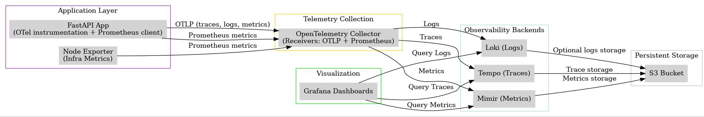

# Complete Observability Stack - Deployment Guide



## 📋 Table of Contents
- [Overview](#overview)
- [Architecture Components](#architecture-components)
- [Prerequisites](#prerequisites)
- [Installation & Setup](#installation--setup)
- [Configuration Files](#configuration-files)
- [Accessing Services](#accessing-services)
- [Data Flow](#data-flow)
- [Monitoring & Alerts](#monitoring--alerts)
- [Troubleshooting](#troubleshooting)
- [Production Considerations](#production-considerations)

---

## 🎯 Overview

This repository contains a complete observability stack for monitoring FastAPI applications deployed on AWS EC2. It implements the **three pillars of observability** using the Grafana LGTM stack:

- **Logs** - Grafana Loki
- **Metrics** - Grafana Mimir  
- **Traces** - Grafana Tempo

All telemetry data is collected via **OpenTelemetry Collector** and visualized in **Grafana**.

### Key Features
✅ Unified observability platform  
✅ OpenTelemetry standards-based  
✅ Infrastructure & application monitoring  
✅ Distributed tracing capabilities  
✅ Long-term metrics storage  
✅ Centralized log aggregation  
✅ Easy correlation between signals  

---

## 🏗️ Architecture Components

### Application Layer
- **FastAPI Application** (`task-tracker`)
  - Instrumented with OpenTelemetry SDK
  - Exposes Prometheus metrics
  - Sends OTLP telemetry to collector
  
- **PostgreSQL Database**
  - Application data store
  - Port: 5432

- **Node Exporter**
  - Collects infrastructure metrics (CPU, memory, disk, network)
  - Port: 9100

### Telemetry Collection
- **OpenTelemetry Collector**
  - Central telemetry hub
  - OTLP gRPC receiver (port 4317)
  - Prometheus metrics endpoint (port 8888)
  - Routes data to Loki, Tempo, and Mimir

### Storage Backends
- **Grafana Loki** (Port 3100)
  - Log aggregation and storage
  - LogQL query language
  
- **Grafana Tempo** (Port 3200)
  - Distributed trace storage
  - Trace correlation
  
- **Grafana Mimir** (Port 9009)
  - Long-term metrics storage
  - Prometheus-compatible

### Visualization
- **Grafana** (Port 3000)
  - Unified dashboard UI
  - Connects to all backends
  - Default credentials: admin/admin

### Ingress
- **Nginx Reverse Proxy** (Ports 80/443)
  - Routes external traffic
  - SSL/TLS termination ready

---

## 📦 Prerequisites

### AWS EC2 Instance
- **Recommended Instance Type**: t3.medium or larger
- **OS**: Amazon Linux 2 / Ubuntu 20.04+
- **Storage**: 50GB+ EBS volume
- **Security Group Rules**:
  - Port 80 (HTTP)
  - Port 443 (HTTPS)
  - Port 22 (SSH)
  - Port 3000 (CUSTOM TCP)
  
**Terraform script is used to provision the Resources**
**git clone -b infra <repo-url>**
## 🔄 CI/CD Pipeline
**Pipeline Overview**
The GitHub Actions workflow automates the entire provisioning process:
**terraform.yml**
Manual trigger -> resource will get provisioned

Notes:
**Configure AWS Credentials in Github Secrets**
**the terraform state file is stored in a S3 bucket for state persistent across github runners.**
### Software Requirements
```bash
# Docker Engine 20.10+
docker --version

# Docker Compose 2.0+
docker-compose --version

docker login -u <registry  -p <password>
```

---
## 🔄 CI/CD Pipeline
**Pipeline Overview**
The GitHub Actions workflow automates the entire deployment process:
Code Push → Run Tests → Build Docker Image → Push to Registry → Deploy to EC2
**Pipeline Stages**
**Stage 1: Build & Test (build-test job)**

Checks out code from repository
Sets up Python 3.11 environment
Caches pip dependencies for faster builds
Installs project dependencies
Starts PostgreSQL test database in Docker
Runs pytest test suite with coverage
Fails fast on first test failure

**Stage 2: Build & Push (build-push job)**

Depends on successful test completion
Logs into Docker Hub
Builds Docker image: 81200/task-tracker:latest
Pushes image to Docker Hub registry
Executes deployment script to EC2

## 🚀 Local Installation & Setup

### 1. Clone the Repository
```bash
git clone <repo-url>
cd yml
```

### 2. Project Structure
```
yml/
├── docker-compose.yml
├── nginx.conf
├── otel-collector-config.yml
├── tempo-config.yml
├── loki-config.yml
├── mimir-config.yml
├── loki-data/               # Created automatically
├── mimir-data/              # Created automatically
└── README.md
```

### 3. Create Required Directories
```bash
mkdir -p loki-data mimir-data
sudo chown -R 10001:10001 loki-data
```

### 4. Start the Stack
```bash
# Pull all images
docker-compose pull

# Start services in detached mode
docker-compose up -d

# View logs
docker-compose logs -f

# Check service status
docker-compose ps
```

### 5. Verify Services
```bash
# Check all containers are running
docker-compose ps

# Test endpoints
curl http://localhost:3000      # Grafana
curl http://localhost:3100/ready  # Loki
curl http://localhost:3200/ready  # Tempo
curl http://localhost:9009/ready  # Mimir
curl http://localhost:9100/metrics # Node Exporter
```

---

## ⚙️ Configuration Files

### OpenTelemetry Collector (`otel-collector-config.yml`)
```yaml
receivers:
  otlp:
    protocols:
      grpc: 
        endpoint: 0.0.0.0:4317
      http: 
        endpoint: 0.0.0.0:4318
  prometheus:
    config:
      scrape_configs:
        - job_name: 'node_exporter'
          static_configs:
            - targets: ['node-exporter:9100']  # Adjust if Node Exporter runs elsewhere
        - job_name: 'app'
          static_configs:
            - targets: ['task-tracker:8000']  # Your app metrics endpoint

processors:
  batch:

exporters:
  debug:
    verbosity: basic
  otlphttp:
    traces_endpoint: http://tempo:4316/v1/traces
    logs_endpoint: http://loki:3100/otlp/v1/logs
    metrics_endpoint: http://mimir:9009/otlp/v1/metrics
    tls:
      insecure: true

service:
  pipelines:
    traces:
      receivers: [otlp]
      processors: [batch]
      exporters: [otlphttp]

    metrics:
      receivers: [otlp, prometheus]
      processors: [batch]
      exporters: [otlphttp]

    logs:
      receivers: [otlp]
      processors: [batch]
      exporters: [otlphttp]
```

### Tempo Configuration (`tempo-config.yml`)
```yaml
server:
  http_listen_port: 3200

distributor:
  receivers:
    otlp:
      protocols:
        grpc: 
          endpoint: 0.0.0.0:4315
        http: 
          endpoint: 0.0.0.0:4316

storage:
  trace:
    backend: s3
    s3:
      bucket: ${S3_BUCKET}
      endpoint: s3.amazonaws.com
      region: ap-south-1
      access_key: ${S3_ACCESS_KEY}
      secret_key: ${S3_SECRET_KEY}
      insecure: false

compactor:
  compaction:
    compaction_window: 1m
```

### Loki Configuration (`loki-config.yml`)
```yaml
auth_enabled: false

server:
  http_listen_port: 3100

common:
  path_prefix: /loki   

ingester:
  lifecycler:
    address: 127.0.0.1
    ring:
      kvstore:
        store: inmemory
      replication_factor: 1
    final_sleep: 0s

storage_config:
  aws:
    bucketnames: ${S3_BUCKET}
    s3forcepathstyle: true
    region: ap-south-1
    access_key_id: ${S3_ACCESS_KEY}
    secret_access_key: ${S3_SECRET_KEY}
  tsdb_shipper:
    active_index_directory: /loki/tsdb-index
    cache_location: /loki/tsdb-cache
schema_config:
  configs:
    - from: 2025-09-30
      store: tsdb
      object_store: aws
      schema: v13
      index:
        prefix: index_
        period: 24h

compactor:
  working_directory: /loki/compactor

limits_config:
  reject_old_samples: true
  reject_old_samples_max_age: 168h
  max_query_lookback: 0s
```

### Mimir Configuration (`mimir-config.yml`)
```yaml
target: all
multitenancy_enabled: false

server:
  http_listen_port: 9009
  grpc_listen_port: 9095

common:
  storage:
    backend: s3
    s3:
      endpoint: s3.ap-south-1.amazonaws.com
      region: ap-south-1
      access_key_id: ${S3_ACCESS_KEY}
      secret_access_key: ${S3_SECRET_KEY}
blocks_storage:
  s3:
    bucket_name: ${S3_BUCKET}
  storage_prefix: "blocks"

alertmanager_storage:
  s3:
    bucket_name: ${S3_BUCKET}
  storage_prefix: "alertmanager"

ruler_storage:
  s3:
    bucket_name: ${S3_BUCKET}
  storage_prefix: "ruler"
ingester:
  ring:
    replication_factor: 1
```

### Nginx Configuration (`nginx.conf`)
```nginx
events {}

http {
    upstream api {
        server task-tracker:8000;
    }

    upstream loki {
        server loki:3100;
    }

    upstream tempo {
        server tempo:3200;
    }

    upstream mimir {
        server mimir:9009;
    }

    server {
        listen 80;

        # ------------------------
        # API service (/api/)
        # ------------------------
        location /api/ {
            proxy_pass http://api/;   # trailing slash strips /api/ before sending
            proxy_set_header Host $host;
            proxy_set_header X-Real-IP $remote_addr;
            proxy_set_header X-Forwarded-For $proxy_add_x_forwarded_for;
            proxy_set_header X-Forwarded-Proto $scheme;
        }
        # ------------------------
        # Loki service (/loki/)
        # ------------------------
        location /loki/ {
            proxy_pass http://loki/;
            proxy_set_header Host $host;
            proxy_set_header X-Real-IP $remote_addr;
            proxy_set_header X-Forwarded-For $proxy_add_x_forwarded_for;
            proxy_set_header X-Forwarded-Proto $scheme;
        }

        # ------------------------
        # Tempo service (/tempo/)
        # ------------------------
        location /tempo/ {
            proxy_pass http://tempo/;
            proxy_set_header Host $host;
            proxy_set_header X-Real-IP $remote_addr;
            proxy_set_header X-Forwarded-For $proxy_add_x_forwarded_for;
            proxy_set_header X-Forwarded-Proto $scheme;
        }

        # ------------------------
        # Mimir service (/mimir/)
        # ------------------------
        location /mimir/ {
            proxy_pass http://mimir/;
            proxy_set_header Host $host;
            proxy_set_header X-Real-IP $remote_addr;
            proxy_set_header X-Forwarded-For $proxy_add_x_forwarded_for;
            proxy_set_header X-Forwarded-Proto $scheme;
        }
    }
}
```

---

## 🌐 Accessing Services

| Service | URL | Default Credentials |
|---------|-----|-------------------|
| Grafana Dashboard | `http://13.203.213.97:3000` | admin / admin |
| FastAPI Application | `http://13.203.213.97/api` | - |
| Prometheus Metrics | `http://13.203.213.97:8888/metrics` | - |
| Node Exporter | `http://13.203.213.97:9100/metrics` | - |

### Setting Up Grafana Data Sources

1. **Login to Grafana** (`http://13.203.213.97:3000`)
2. **Add Data Sources**:

**Loki:**
- URL: `http://13.203.213.97/loki`
- Access: Server (default)
- Skip TLS verification

**Tempo:**
- URL: `http://13.203.213.97/tempo`
- Access: Server (default)
- Skip TLS verification

**Mimir:**
- URL: `http://13.203.213.97/mimir/prometheus`
- Access: Server (default)
- Skip TLS verification

3. **Go to Explore tab in Grafana Dashboard**

---

## 📊 Data Flow

### Trace Collection Flow
```
User Request → FastAPI App (OTel SDK) 
  → OTLP gRPC (port 4317) → OTel Collector 
  → Tempo → Grafana Visualization
```

### Metrics Collection Flow
```
Infrastructure → Node Exporter (port 9100)
  → Prometheus Scrape → OTel Collector
  → Mimir → Grafana Dashboards

Application → FastAPI Metrics
  → OTLP → OTel Collector
  → Mimir → Grafana Dashboards
```

### Logs Collection Flow
```
FastAPI App → OTel SDK Logs
  → OTLP → OTel Collector
  → Loki → Grafana Log Explorer
```

---

## 🔔 Monitoring & Alerts

### Key Metrics to Monitor
- **Application**: Request rate, error rate, latency (RED metrics)
- **Infrastructure**: CPU, memory, disk usage, network I/O
- **Services**: Container health, restart counts

### Setting Up Alerts in Grafana
1. Navigate to **Alerting** → **Alert rules**
2. Create rules for:
   - High error rates (>5%)
   - High latency (p95 > 1s)
   - CPU usage (>80%)
   - Disk usage (>85%)
   - Container down

---

## 🔧 Troubleshooting

### Check Container Logs
```bash
# All services
docker-compose logs

# Specific service
docker-compose logs -f otel-collector
docker-compose logs -f grafana
```

### Common Issues

**OTel Collector not receiving data:**
```bash
# Check if port 4317 is accessible
netstat -tuln | grep 4317

# Verify collector config
docker-compose exec otel-collector cat /etc/otel-collector-config.yml
```

**Loki permission errors:**
```bash
# Fix permissions
sudo chown -R 10001:10001 ./loki-data
docker-compose restart loki
```

**Services not starting:**
```bash
# Check resource usage
docker stats

# Remove and recreate
docker-compose down -v
docker-compose up -d
```

### Verify Data Ingestion
```bash
# Check Loki logs
curl http://localhost:3100/loki/api/v1/query?query={job="varlogs"}

# Check Mimir metrics
curl http://localhost:9009/prometheus/api/v1/query?query=up

# Check Tempo traces
curl http://localhost:3200/api/search
```

---

## 🚀 Production Considerations

### 1. Persistence & Backup
```bash
# Backup volumes
docker run --rm -v observability-stack_pg_data:/data \
  -v $(pwd):/backup ubuntu tar cvf /backup/backup.tar /data

# Use S3 for long-term storage (update configs):
# - Loki: s3 storage backend
# - Tempo: s3 backend
# - Mimir: s3 blocks storage
```

### 2. Security Enhancements
- Enable SSL/TLS in Nginx
- Change default Grafana password
- Implement authentication for APIs
- Use AWS Secrets Manager for credentials
- Enable firewall rules

### 3. Resource Optimization
```yaml
# Add resource limits in docker-compose.yml
services:
  api:
    deploy:
      resources:
        limits:
          cpus: '2'
          memory: 2G
        reservations:
          cpus: '1'
          memory: 1G
```

### 4. High Availability
- Use AWS ELB for load balancing
- Deploy multiple EC2 instances
- Configure Loki/Tempo/Mimir in clustered mode
- Use RDS for PostgreSQL

### 5. Cost Optimization
- Use S3 storage for cold data
- Implement retention policies
- Set up log sampling
- Use spot instances for non-critical workloads

### 6. Monitoring the Monitor
- Set up CloudWatch alarms for EC2 metrics
- Configure SNS notifications
- Monitor Docker daemon health
- Track disk space usage

---

## 📝 Commands Reference

```bash
# Start stack
docker-compose up -d

# Stop stack
docker-compose down

# Restart specific service
docker-compose restart otel-collector

# View logs
docker-compose logs -f [service-name]

# Execute command in container
docker-compose exec grafana /bin/bash

# Remove volumes (⚠️ deletes data)
docker-compose down -v

# Update images
docker-compose pull
docker-compose up -d

# Scale service (if configured)
docker-compose up -d --scale api=3
```

---

## 📚 Additional Resources

- [OpenTelemetry Documentation](https://opentelemetry.io/docs/)
- [Grafana Documentation](https://grafana.com/docs/)
- [Loki Documentation](https://grafana.com/docs/loki/)
- [Tempo Documentation](https://grafana.com/docs/tempo/)
- [Mimir Documentation](https://grafana.com/docs/mimir/)
- [Docker Compose Documentation](https://docs.docker.com/compose/)

---


